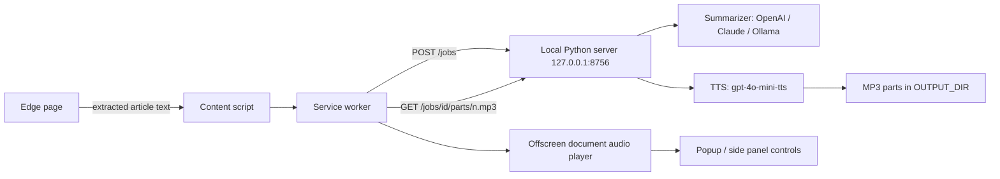

# Browser Extension Plan (Edge / Chromium)

## Goal

Let a user click a toolbar button (or press a shortcut) on any page in Microsoft
Edge and have ReadItToMe summarize that page and speak the summary, with pause,
resume, skip, and seek controls in the browser. All AI keys, audio files, and
processing stay on the user's own machine.

## Feasibility

Feasible, and a better fit than the current CLI for several reasons:

- Edge is Chromium-based, so a single Manifest V3 extension works in Edge,
  Chrome, and Brave with no code changes.
- An extension can read the **already-rendered DOM**, which fixes the biggest
  weakness of `get_web_page_contents()`: `requests.get()` fails on JavaScript
  rendered pages, cookie-walled content, and sites that block non-browser user
  agents. The extension sends text the user can already see.
- Audio playback moves from `pygame` to the browser's native `<audio>` element,
  which gives pause, resume, seek, playback speed, and OS media keys for free.
- The existing summarization and text-to-speech pipeline (`talk_to_ai`,
  `split_text_for_tts`, `generate_audio_parts`) is reusable as-is behind an HTTP
  API. No AI logic needs to be rewritten.

The one hard constraint: an extension cannot hold the OpenAI/Anthropic keys
safely, and browsers cannot run the Python pipeline. So a **local HTTP server on
the user's machine** is required, exactly as suggested.

## Architecture



Three components:

1. **Local server** (new, Python) — FastAPI + Uvicorn wrapping the existing
   pipeline. Binds to `127.0.0.1` only.
2. **Extension** (new, MV3) — content script for extraction, service worker for
   orchestration, offscreen document for playback, popup or side panel for UI.
3. **Refactored core** (existing `main.py`, split into importable modules) so
   the CLI and the server share one implementation.

## Part 1: Refactor `main.py` into a package

`main.py` currently mixes config loading, extraction, summarization, chunking,
TTS, pygame playback, and CLI argument handling, and it reads globals
(`API_KEY`, `SELECTED_MODEL`, `args`) that only exist under
`if __name__ == "__main__"`. `process_single_url()` cannot be imported today.

Proposed layout, keeping CLI behavior identical:

| Module | Contents |
| --- | --- |
| `readittome/config.py` | `load_config()` returning a typed `Config` object instead of module globals |
| `readittome/extract.py` | `get_web_page_contents()` plus a new `clean_text()` used for browser-supplied text |
| `readittome/summarize.py` | `talk_to_ai()`, both system prompts, `estimate_tokens()` |
| `readittome/tts.py` | `split_text_for_tts()`, `generate_audio()`, `generate_audio_parts()`, `audio_part_paths()` |
| `readittome/naming.py` | `generate_filename_from_url()`, `clean_and_shorten_text()`, `save_summary()` |
| `readittome/playback.py` | `PlaybackControl`, pygame playback, keyboard listener (CLI only) |
| `readittome/pipeline.py` | `summarize_and_speak(text_or_url, options, on_part_ready)` shared by CLI and server |
| `readittome/server.py` | FastAPI app (new) |
| `main.py` | Thin CLI wrapper over `pipeline` — same flags, same output |

Required behavior changes during the refactor:

- Replace `args.silent` / `args.long` global reads inside pipeline functions
  with explicit parameters.
- Replace module-level `API_KEY` / `SELECTED_MODEL` reads with values passed in
  or carried on a config object.
- Keep `tests/test_main.py` passing; update imports only where modules moved.

This refactor is the only meaningful work on the existing codebase, and it is
worth doing independently of the extension.

## Part 2: Local server

Single-user local daemon. Start with `py main.py --serve` (or a small
`serve.py`), optionally with a `pystray` tray icon showing status.

### Endpoints

| Method | Path | Purpose |
| --- | --- | --- |
| `GET` | `/health` | Version, model names, ready state. Used by the extension to show connected/disconnected |
| `POST` | `/jobs` | Body: `{url, title, text, mode: "short"\|"long", voice?}`. Returns `{job_id}` immediately |
| `GET` | `/jobs/{id}` | Status: `queued`, `summarizing`, `generating`, `ready`, `error`; plus `parts_ready`, `parts_total`, `summary` |
| `GET` | `/jobs/{id}/events` | Optional Server-Sent Events stream of the same status, avoids polling |
| `GET` | `/jobs/{id}/parts/{n}.mp3` | Streams one MP3 part with HTTP range support so the browser can seek |
| `GET` | `/jobs/{id}/summary.txt` | The text summary, for a "read along" pane |
| `DELETE` | `/jobs/{id}` | Cancel an in-flight job |

### Job model

- Jobs run on a background thread (or `asyncio.to_thread`) so `POST /jobs`
  returns instantly.
- `generate_audio_parts(..., on_part_ready=...)` already emits parts as they
  finish. The callback marks each part available so **playback of part 1 starts
  while part 5 is still generating** — the same streaming behavior the CLI has
  today.
- One in-flight job at a time by default; starting a new one cancels the old.
- MP3s continue to be written to `OUTPUT_DIR`, so files remain usable in a media
  player and existing playlist workflows are unaffected.

### Caching

Key jobs by `sha256(normalized_url + mode + model + voice)`. If the audio parts
and summary already exist on disk, return `ready` immediately with zero API
cost. This makes re-opening a page instant and is a genuine improvement over the
current filename-collision behavior in `generate_filename_from_url()`.

### Security (important)

Any web page you visit can make requests to `http://127.0.0.1`. Without
protection, a malicious page could spend your OpenAI credits. Required controls:

- Bind to `127.0.0.1` only. Never `0.0.0.0`.
- Generate a random token at first run, store it in `config.json` as
  `LOCAL_SERVER_TOKEN`, and require it in an `X-ReadItToMe-Token` header. The
  extension options page holds a copy.
- Pin the extension's ID by adding a `key` to the manifest, then allow only
  `chrome-extension://<that id>` in the `Origin` check and CORS response.
- Reject requests with a `Sec-Fetch-Site` of `cross-site` from ordinary pages.
- Cap request body size (e.g. 1 MB of page text) and rate-limit job creation.

## Part 3: The extension

Manifest V3, `manifest_version: 3`.

### Permissions

```json
{
  "permissions": ["activeTab", "scripting", "storage", "offscreen", "contextMenus"],
  "optional_permissions": ["tabs"],
  "host_permissions": ["http://127.0.0.1:8756/*"],
  "commands": { "read-page": { "suggested_key": { "default": "Ctrl+Shift+R" } } }
}
```

`activeTab` + `scripting` means no broad host permission on websites is needed;
content is only read from the tab when the user clicks.

### Content extraction

Inject a content script on demand that runs Mozilla's **Readability.js**
(MIT-licensed, vendored into the repo) over a `document.cloneNode(true)`. This
is what Firefox Reader Mode uses and it strips nav, ads, and boilerplate far
better than `soup.get_text()`. Fall back to `document.body.innerText` when
Readability returns nothing. Send `{url, title, byline, text}` to the server.

Special cases worth handling early:

- **Selection mode** — if text is selected, summarize only the selection.
- **YouTube** — no meaningful article text; either skip or read the transcript
  panel if present. Explicitly out of scope for v1.
- **PDFs in the built-in viewer** — content scripts cannot reach the text.
  Detect `.pdf` and fall back to sending the URL for server-side fetch.

### Playback

Audio must survive the popup closing, so playback lives in an **offscreen
document** (`chrome.offscreen` with reason `AUDIO_PLAYBACK`) that owns a single
`<audio>` element and a queue of part URLs. The service worker messages it to
play, pause, seek, and enqueue newly ready parts.

Controls exposed in the popup (and optionally a side panel, which stays open
while browsing):

- Play / pause, plus the `Ctrl+Shift+R` shortcut and OS media keys via the
  Media Session API.
- Previous / next part, 15-second skip back and forward.
- Scrub bar across the current part, with overall progress as "part 3 of 7".
- Playback speed (0.75x–2x) — a real advantage over the pygame version.
- Voice and short/long mode selectors, persisted in `chrome.storage.sync`.
- Live status: "Extracting", "Summarizing with gpt-5.6-sol", "Generating audio
  2 of 7", "Playing".
- A badge on the toolbar icon showing generating / playing state.
- "Server not running" state with a clear instruction on how to start it.

### Entry points

- Toolbar icon click.
- Right-click context menu: "Read this page to me" and "Read selection to me".
- Keyboard shortcut.

## Alternatives considered

- **Pure extension using the Web Speech API** — no server needed, but robotic
  voices and no way to run summarization without embedding an API key in the
  extension. Rejected; loses the core value of the project.
- **Native messaging host instead of HTTP** — avoids the localhost port and its
  security concerns, but requires a registry-installed manifest per browser, is
  awkward to debug, and streams binary audio poorly. HTTP with a token is
  simpler and lets the same server serve future clients.
- **WebSocket instead of SSE + range requests** — more moving parts for no real
  gain; audio needs plain HTTP range requests for seeking regardless.

## Risks and open questions

- Chromium is tightening **Local Network Access** restrictions; extension
  service worker requests with explicit `host_permissions` for `127.0.0.1`
  should remain allowed, but this should be verified early in Phase 1 on the
  current Edge build.
- The server must be running. Mitigations: a tray app, a documented Startup
  folder shortcut or Task Scheduler entry, and a clear disconnected state in the
  popup.
- Cost visibility — one click can trigger a long summary. Show an estimated cost
  or word count before starting when the page exceeds a configurable size, and
  keep the `--long` equivalent off by default.
- Edge Add-ons store submission is optional; sideloading unpacked via
  `edge://extensions` is enough for personal use and avoids review friction.

## Phased delivery

| Phase | Scope | Outcome |
| --- | --- | --- |
| 1 | Spike: hardcoded extension that POSTs page text to a stub server and plays one static MP3 | Proves permissions, localhost access, and offscreen playback in Edge |
| 2 | Refactor `main.py` into `readittome/` with the CLI unchanged and tests green | Importable core |
| 3 | FastAPI server with jobs, streaming parts, token auth, and caching | `curl` can drive the full pipeline |
| 4 | Real extension: Readability extraction, status UI, queued part playback, play/pause | Usable end to end |
| 5 | Polish: seek, speed, media keys, context menus, side panel, options page, voice/mode settings | Feature complete |
| 6 | Docs, packaging, tray icon, autostart instructions, optional Chrome/Firefox notes | Shippable |

## Testing

- Unit tests for the new server layer with the OpenAI and Anthropic clients
  mocked, asserting job lifecycle, part ordering, cancellation, and cache hits.
- Auth tests: missing token rejected, wrong origin rejected, oversized body
  rejected.
- Existing `tests/test_main.py` must keep passing through the refactor.
- Manual matrix: article page, Hacker News thread, single-page app, page
  requiring login, text selection, PDF, and a page with no extractable text.

## Acceptance criteria

- Clicking the toolbar icon on an article in Edge starts audible playback of a
  ReadItToMe summary without any terminal interaction.
- Playback begins on part 1 while later parts are still generating.
- Pause and resume work from the popup, the keyboard shortcut, and media keys,
  and playback continues after the popup is closed.
- Revisiting a page already summarized replays instantly with no API calls.
- API keys never leave the local machine and never appear in extension code or
  storage.
- The existing CLI, playlist mode, `--download-only`, and `--save-summaries`
  behave exactly as before.
